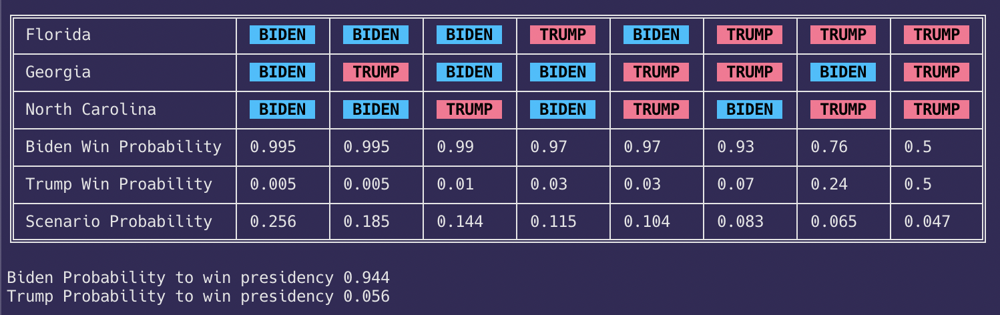

# 2020 Election Needle tracker

# Eh, nevermind

The NYT needle page has everything I was thinking about keeping an eye on here and quite frankly its more likely not to mislead me. Had a fun evening putting this together but dont think ill be using it. Left here to get nostalgic about in like 10 years or whatever

Takes numbers from
https://projects.fivethirtyeight.com/trump-biden-election-map/?cid=abcnews
and
https://projects.fivethirtyeight.com/2020-election-forecast/?cid=rrpromo

and the existance of the NYT needle
https://www.nytimes.com/2020/11/02/upshot/needle-election-forecast.html

Maps out the scenarios for the 3 states NYT is tracking and computes the proabilities of each scenario.

As the night goes on I can run this with the current needle values to update the table.

## isn't this just a spreadsheet?

Yep, mostly wrote this to get some practice. Though I like how the columns sort. To distract myself from the night I may add the ability to pull from the needle.

## Is this accurate?

I mean... I tried? Ive done some probability classes and stats classes in school but this has not been looked at by any experts so if for some reason you are reading this I would approach it with some skepticism.

I am not doing anything too... fancy so I think its plausible. If I thought this would be run by anyone by me I probably would not share the code. I mostly just like pushing my side projects up
